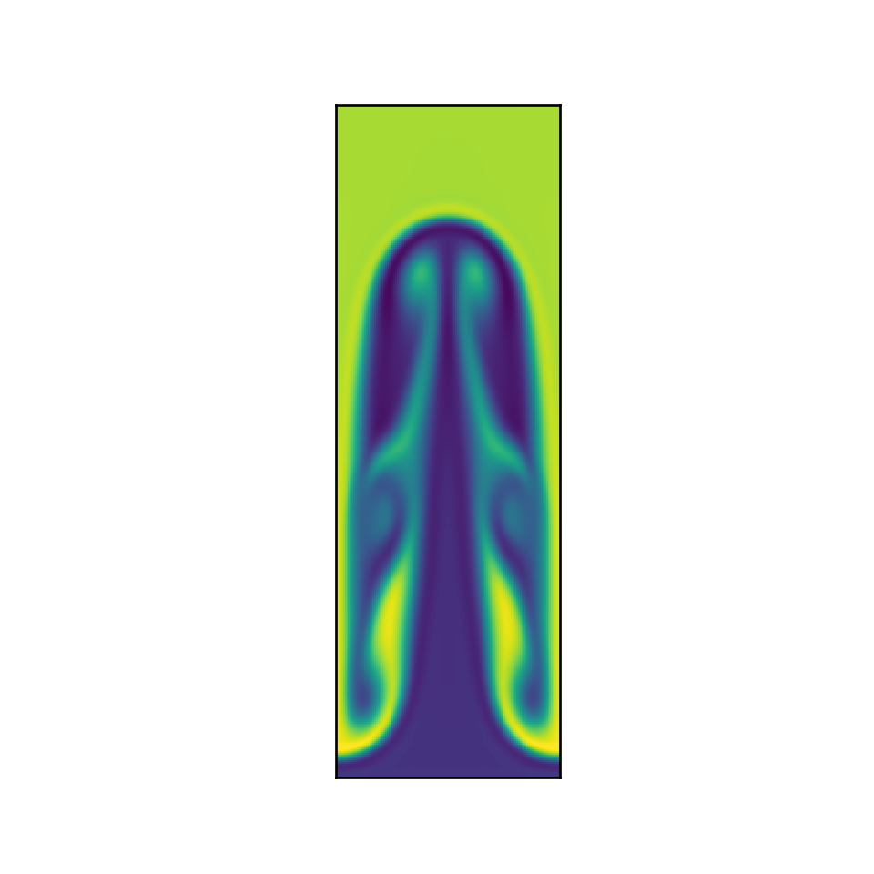

# finitevolume2-python
Finite Volume simulation of the Raleigh-Taylor Instability

## Create Your Own Finite Volume Fluid Simulation (With Python): Part 2 Boundary Conditions and Source Terms

### Philip Mocz (2021) [@PMocz](https://twitter.com/PMocz)

Simulate the Raleigh-Taylor Instability with the Finite Volume Method. Demonstrates gravity source term and Reflecting boundary condition


```
python finitevolume2.py
```


